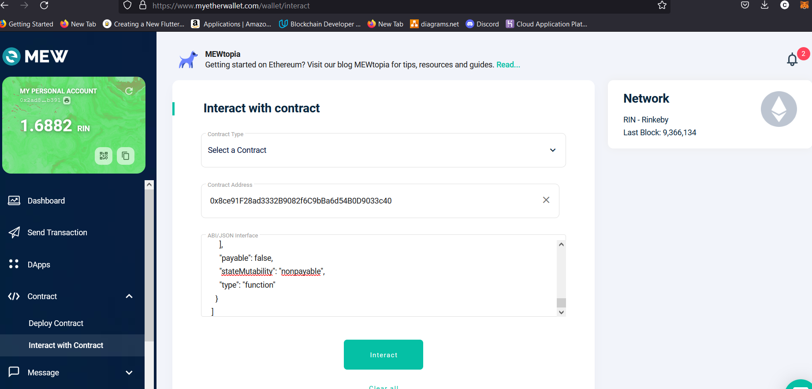
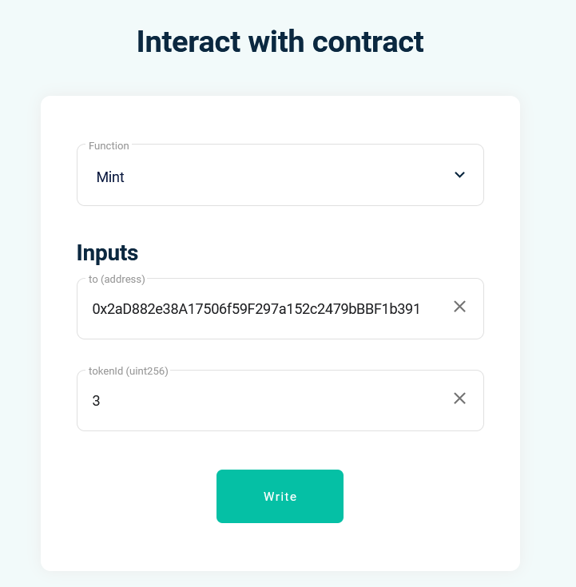
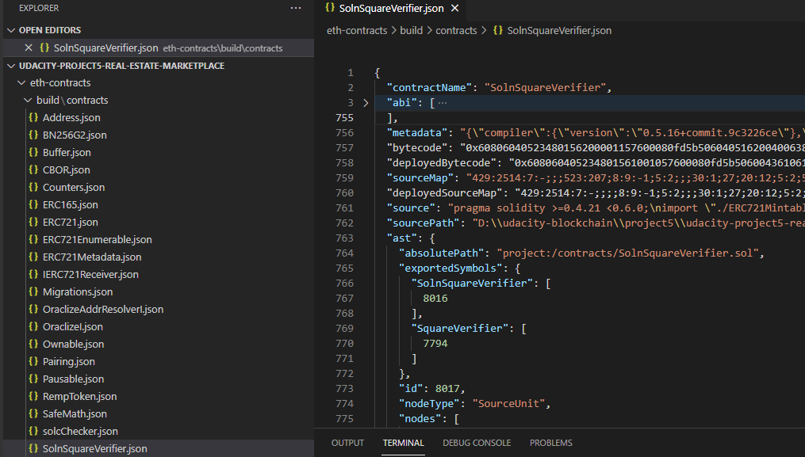
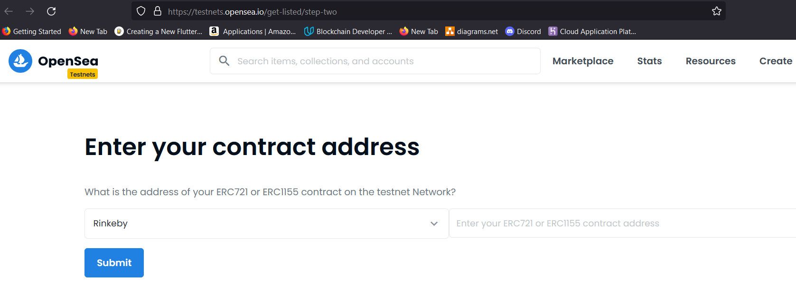
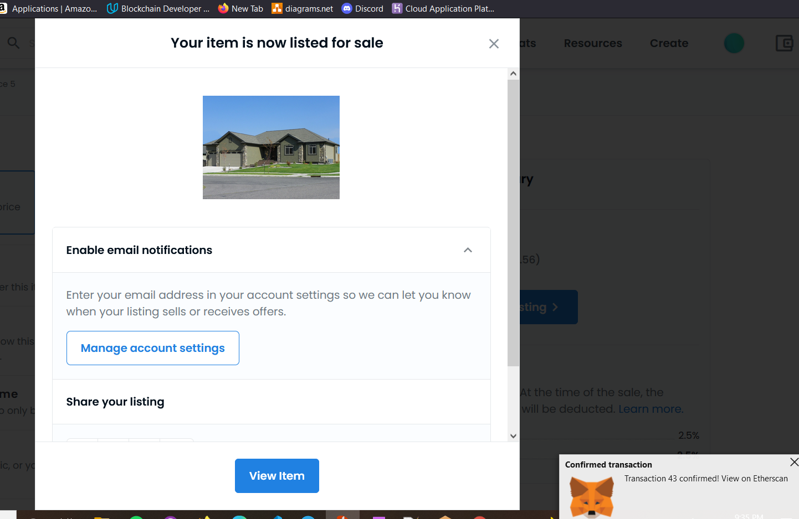
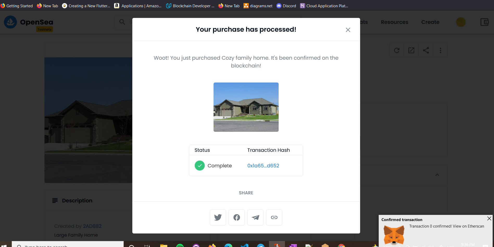

# Udacity Blockchain Capstone

The capstone will build upon the knowledge you have gained in the course in order to build a decentralized housing product. 

# Real Estate Marketplace 5

A decentralized house listing service.

## Installation Guide

To install, download or clone the repo, then:

`npm install`

`cd eth-contracts`  

Update __infuraKey and mnemonic__ in truffle-config.js

`truffle compile`  

Open a separate terminal, and run:

`ganache-cli -m "spirit supply whale amount human item harsh scare congress discover talent hamster" --accounts=50`

 

## Testing the smart contracts

Go back to the main terminal with path eth-contracts and run:

`truffle test ./test/TestERC721Mintable.js`

`truffle test ./test/TestSolnSquareVerifier.js`

`truffle test ./test/TestSquareVerifier.js`  

 

## Migrating the smart contracts
   
   - localhost network

        `truffle migrate --reset`
   - Rinkeby Public network

        `truffle migrate --reset --network rinkeby`

 

## Zokrates Setup with Docker

1. Install [Docker](https://docs.docker.com/get-docker/) to be able to instantiate a Zokrates zkSnarks development environment
3. Run ZoKrates docker container: `docker run -v /path/to/zokrates/zokrates/code:/home/zokrates/code -ti zokrates/zokrates /bin/bash` 
4. Now you are inside the container. Change path to the code/square folder: `cd code/square`
5. Compile the program written in ZoKrates DSL: `zokrates compile -i square.code`
6. Generate the Trusted Setup: `zokrates setup`
7. Compute Witness: `zokrates compute-witness -a 3 9`
8. Generate Proof: `zokrates generate-proof`
9. Export Verifier: `zokrates export-verifier`  
    - The last command generated a 'verifier' smart contract which I copied to the **eth-contracts/contracts** as **Verifier.sol**.  
 

# Token Minting

Once the smart contract is deployed, MEW contract interface can be used to
interact with the contract:

1. Go to https://www.myetherwallet.com/wallet/interact and copy contract  and ABI

2. Mint some tokens

 

## Contract Abi's
    Contract Abi's can be found in **eth-contracts/build/contracts/** 

 

# OpenSea Marketplace

1. Once tokens are minted, go to https://testnets.opensea.io/get-listed/step-two and submit contract.

__My Real Estate Marketplace 5 URL__ - https://testnets.opensea.io/collection/real-estate-marketplace-5?collectionSlug=real-estate-marketplace-5

# Contract

Contract info on etherscan.io: https://rinkeby.etherscan.io/address/0x8ce91f28ad3332b9082f6c9bba6d54b0d9033c40

Token info on etherscan.io: https://rinkeby.etherscan.io/token/0x8ce91f28ad3332b9082f6c9bba6d54b0d9033c40

Token transaction on etherscan.io: https://rinkeby.etherscan.io/tx/0x1a65e6a920c0a84d42ffc04c2c979cb90451d37f84ab19436218d79fef7cd652

 

 

# Versions

`truffle version`

    Truffle v5.4.6 (core: 5.4.6)
    Solidity v0.5.16 (solc-js)
    Node v15.14.0
    Web3.js v1.5.1

 

# Project Resources

* [Remix - Solidity IDE](https://remix.ethereum.org/)
* [Visual Studio Code](https://code.visualstudio.com/)
* [Truffle Framework](https://truffleframework.com/)
* [Ganache - One Click Blockchain](https://truffleframework.com/ganache)
* [Open Zeppelin ](https://openzeppelin.org/)
* [Interactive zero knowledge 3-colorability demonstration](http://web.mit.edu/~ezyang/Public/graph/svg.html)
* [Docker](https://docs.docker.com/install/)
* [ZoKrates](https://github.com/Zokrates/ZoKrates)
